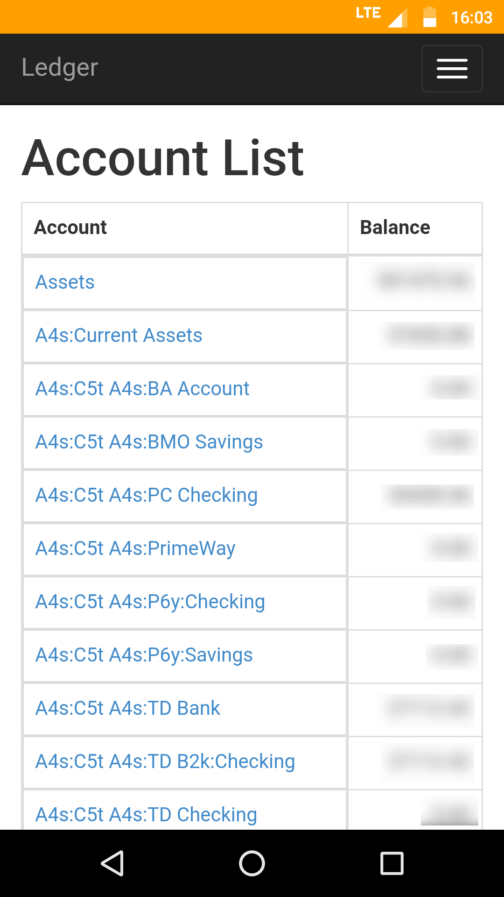
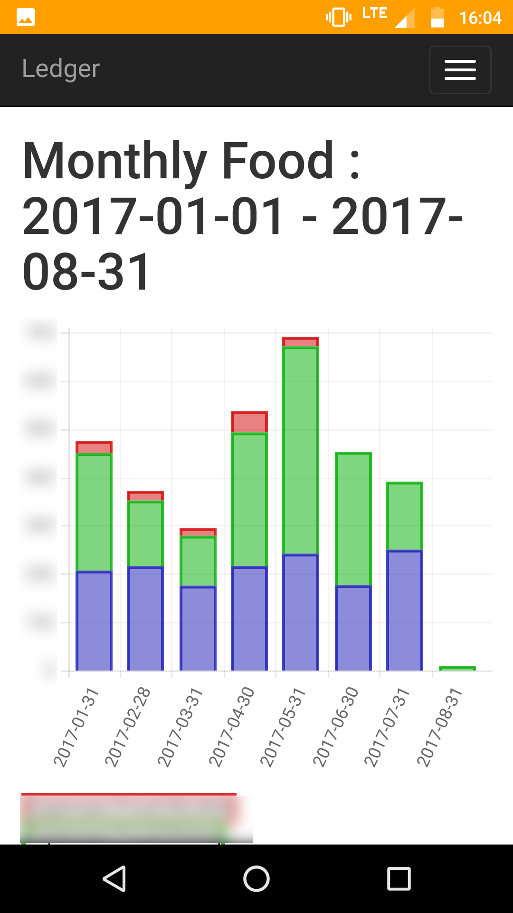
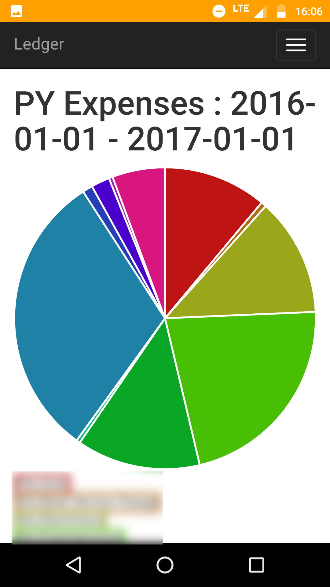

[](https://github.com/howeyc/ledger/releases)
[](https://github.com/howeyc/ledger/releases)
[](https://matrix.to/#/#plaintextaccounting:libera.chat)

# Ledger in Go

This is a project to parse and import transactions in a ledger file similar
to the [Ledger](http://ledger-cli.org) command line tool written in C++.

## Simple Ledger file support

The ledger file this will parse is much simpler than the C++ tool.

Transaction Format:

    <YYYY/MM/dd> <Payee description>
        <Account Name 1>    <Amount 1>
        .
        .
        .
        <Account Name N>    <Amount N>
 
The transaction must balance (the positive amounts must equal negative amounts).
One of the account lines is allowed to have no amount. The amount necessary
to balance the transaction will be added to that account for the transaction.
Amounts must be decimal numbers with a negative(-) sign in front if necessary.

Example transaction:

    2013/01/02 McDonald's #24233 HOUSTON TX
        Expenses:Dining Out:Fast Food        5.60
        Wallet:Cash

A ledger file is a list of transactions separated by a blank line.

A ledger file may include other ledger files using `include <filepath>`. The
`filepath` is relative to the including file.


## ledger lib

This will parse a ledger file into an array of Transaction structs.
There is also a function get balances for all accounts in the ledger file.

[GoDoc](https://pkg.go.dev/github.com/howeyc/ledger/)

## Command Use

### Basic Commands

Example usage:
```sh
export LEDGER_FILE="ledger.dat"

ledger bal
ledger bal Cash
ledger reg
ledger print
ledger stats
ledger lint

ledger -f other_ledger.dat reg
```

### Import Transactions

Using an existing ledger as input to a bayesian classifier, it will attempt to
classify an imported csv of transactions based on payee names and print them in
a ledger file format. 

Attempts to get payee, date, and amount based on headers in the csv file.

Example usage:
```sh
ledger -f ledger.dat import discover discover-recent-transactions.csv
```

In the above example "discover" is the account search string to use to find
the account that all transactions in the csv file should be applied too. The
second account to use for each transaction will be picked based on the
bayesian classification of the payee.

### Web Service

A website view of the ledger file. This program will show the account list,
and ledger for a given account.

Reports available through the web interface are taken from a toml configuration
file of the report configuration. See reports-sample.toml for examples.

Example usage:
```sh
ledger -f ledger.dat web -r reports.toml --port 8080
```

#### Screenshots

The screenshots below are taken on an Android device. To give a rough idea of what the web interface looks like.

  
   

## Installing components

Download the binary for your platform from the [Github Releases](https://github.com/howeyc/ledger/releases) page.

## Incompatibilities

- C++ Ledger permits having amounts prefixed with $; Ledger in Go does not

- C++ Ledger permits an empty *Payee Description*; Ledger in Go does not
