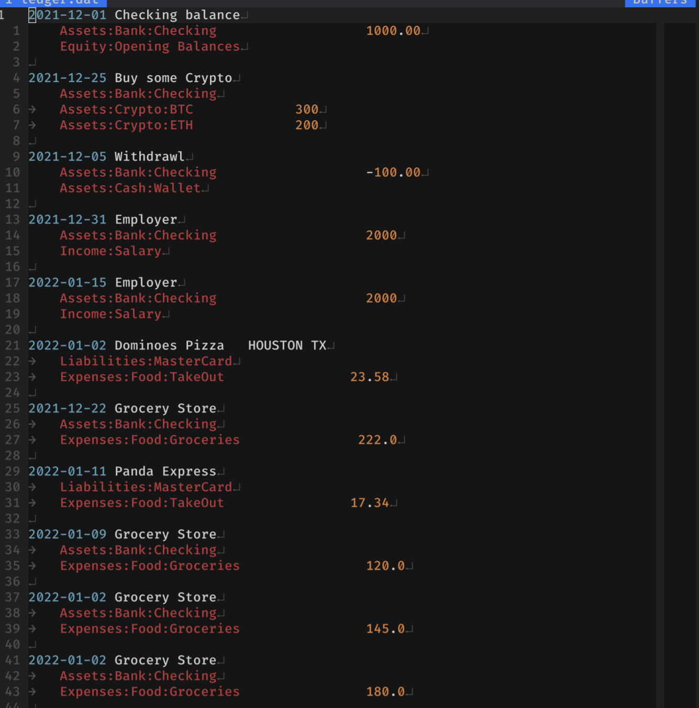
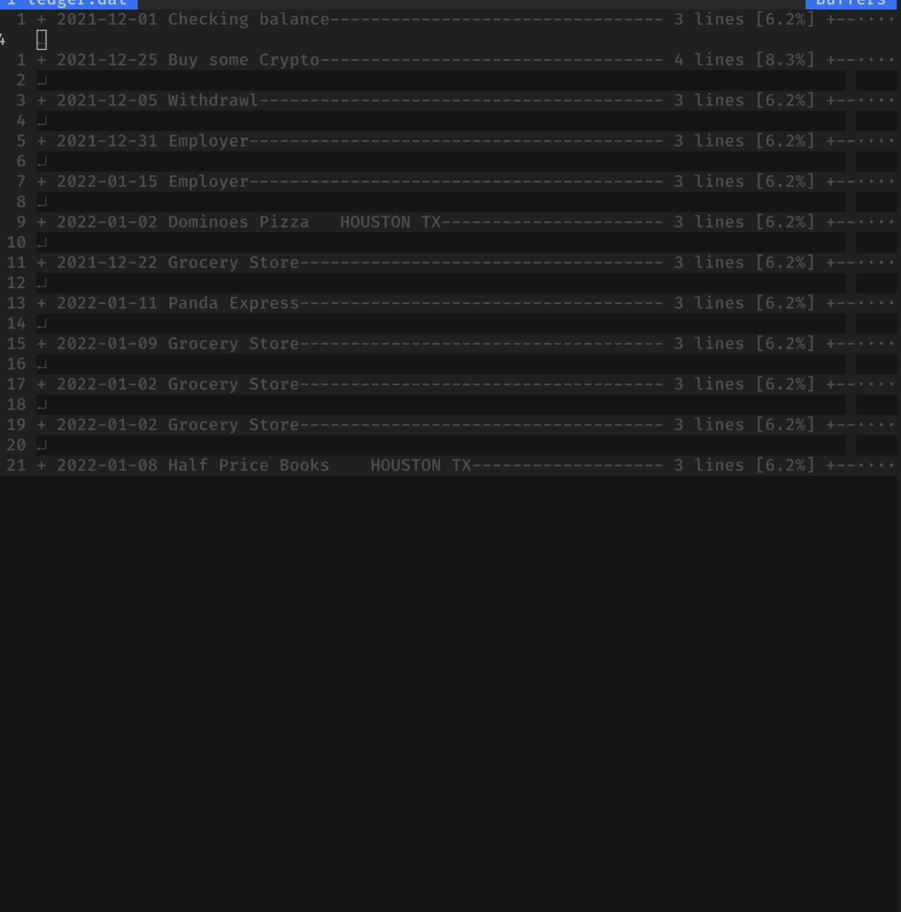

# Editing in Vim

A vim plugin is provided to apply syntax highlighting and account
autocomplete when editing. Install the **vim-ledger** plugin.

Below is the result of `:set filetype=ledger` in vim.

The plugin can also do folding, try `:set foldmethod=syntax`

