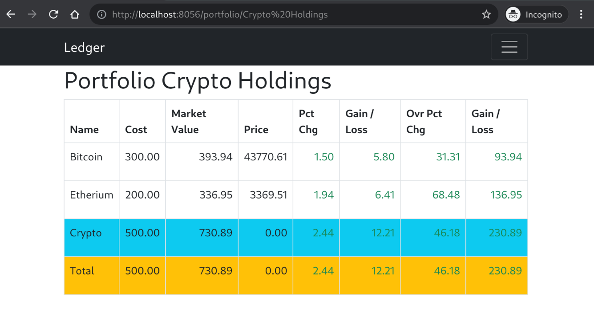

# Portfolio

The web service included in `ledger` allows tracking a portfolio of various
holdings. Currently stocks, mutual funds, and crypto currencies are supported.

Basically, you just create a portfolio configuration file where you match your
accounts to commodities and the shares of the commodity the account represents.

The example configuration shows what crypto currency holding may look like.

`$ cat portfolio.toml`

## Crypto Holdings

Portfolio view of holdings.

## Stocks and Mutual Funds

Stock or Mutual Fund Quotes require API keys to services.

`$ cat portfolio-stocks.toml`
