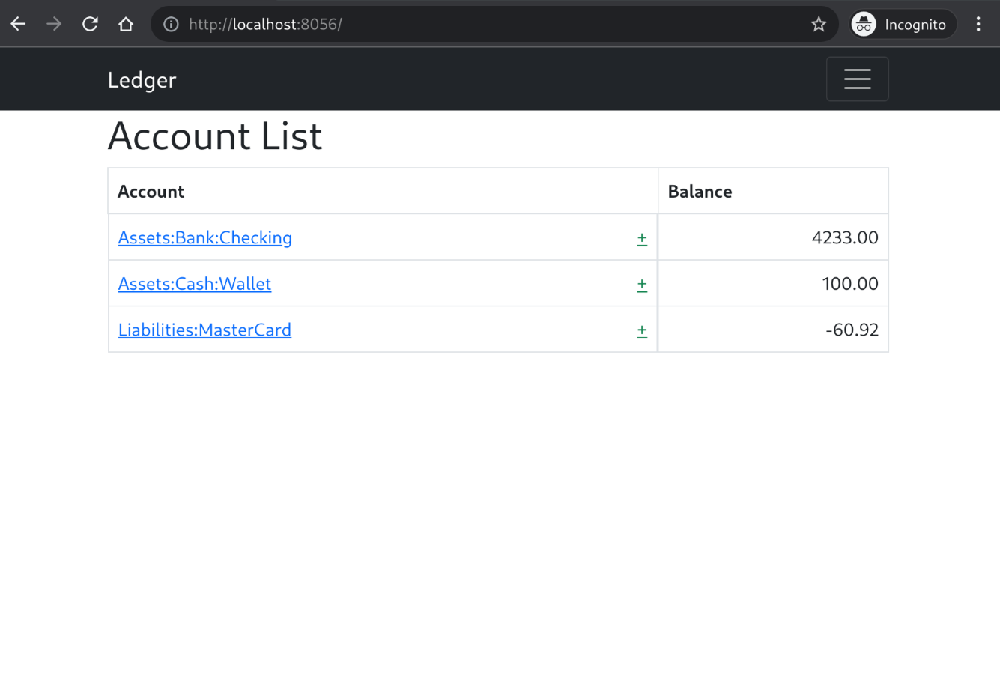

# Quickview

The main page can be configured to show only a
selected subset of all accounts by specifying a *quickview* configuration file.

Take the following example.

`$ cat quickview.toml`

Run it with `ledger -f ledger -q quickview.toml web`

The new, more compact start screen should look like the following.

